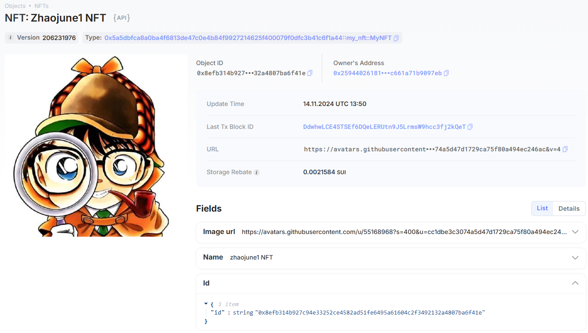

## 基本信息
- Sui钱包地址: `0x729a64681b4f20c22c0f7aff944a5607863390453d4677c0327c4d451bfffe6d`
> 首次参与需要完成第一个任务注册好钱包地址才被合并，并且后续学习奖励会打入这个地址
- github: `zhaojune1`

## 个人简介
- 工作经验: 10年
- 技术栈: `c#` `react` 
> 重要提示 请认真写自己的简介
- 7年彩票系统和3年制造业大厂开发经验，现在学习web3
- 联系方式: vx: `zyl_oscar` 

## 任务

##   01 hello move  
- [x] Sui cli version:sui 1.37.1-7839b9501066
- [x] Sui钱包截图: 
- [x] package id: 0x2ab79391d878d59a9733dca33a771fa7d89e490f2a375316131cd20302297223
- [x] package id 在 scan上的查看截图:

##   02 move coin
- [x] My Coin package id : 0xfbf7f26698915c0bf3e97a31fcdbc6bffcbb95d1ca8fdd4e43db333353df4cac
- [x] Faucet package id : 0xf15f8bed24e795ae72d87a5de55beb55bebbe4c5df4db77a6286b71724505f9d
- [x] 转账 `My Coin` hash: 8CmjbtYFed7AsfZY3bDB1DN8RHk5fGw9u6wvn1EHtuFm
- [x] `Faucet Coin` address1 mint hash: HpSEvZAR9DaVAHEdfZ65Gjz3dNSH2CmDH1E3eZHECR48
- [x] `Faucet Coin` address2 mint hash: BJJkiQLexSC1egJPiyy8UudrYMMKSH4ntkf5CnKEnpuo

##   03 move NFT
- [x] nft package id : 0x5a5dbfca8a0ba4f6813de47c0e4b84f9927214625f400079f0dfc3b41c6f1a44
- [x] nft object id : 0xb8c13a3d117e053311a0c1ba9bc48fa8e80e30534f0eb08de621092a4e433d96
- [x] 转账 nft  hash: 6KTbnnBjxrYggtC4BDWd1BkwLj7CjN2RU4XQHycYyn8e
- [x] scan上的NFT截图:

##   04 Move Game
- [] game package id :
- [] deposit Coin hash:
- [] withdraw `Coin` hash:
- [] play game hash:

##   05 Move Swap
- [] swap package id :
- [] call swap CoinA-> CoinB  hash :
- [] call swap CoinB-> CoinA  hash :

##   06 Dapp-kit SDK PTB
- [] save hash :

##   07 Move CTF Check In
- [] CLI call 截图 : 
- [] flag hash :

##   08 Move CTF Lets Move
- [] proof : 
- [] flag hash :
