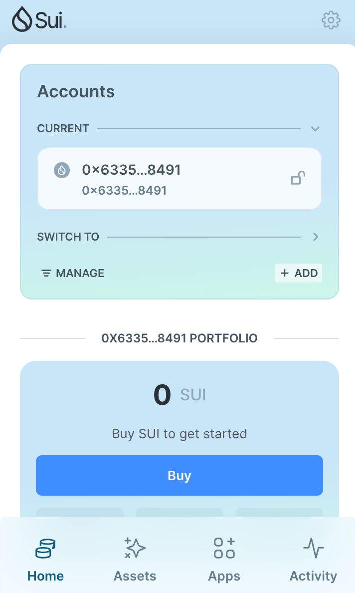
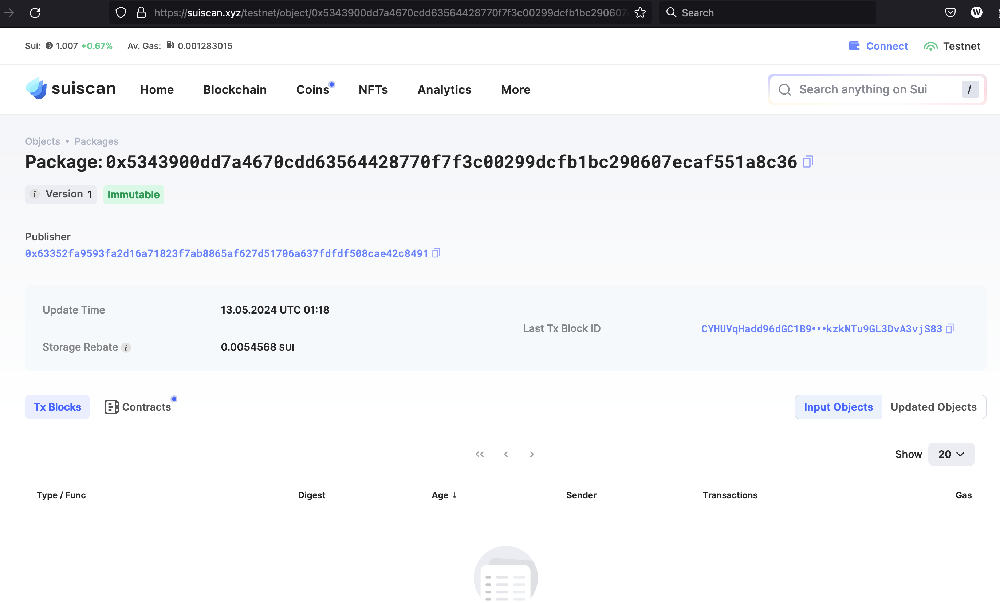
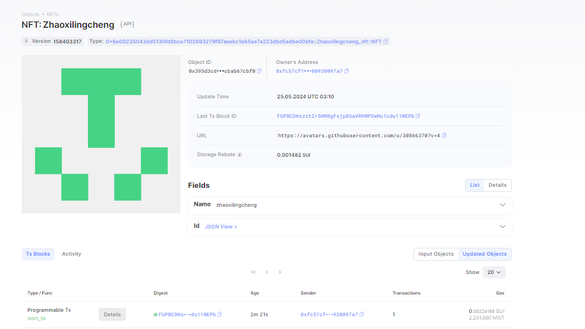

## 基本信息

- Sui钱包地址: 0x830bd6ef28ad356628b0a8f7a904a90d253c8f76a346ea30eb28bf0f4c97d467

  > 首次参与需要完成第一个任务注册好钱包地址才被合并，并且后续学习奖励会打入这个地址

- github: zhaoxilingcheng

## 个人简介

- 工作经验: 7年
- 技术栈: java、python
- 对Move特别感兴趣，想通过Move入门区块链
- 联系方式: tg 社区

## 任务

## 01 hello move
- [x] Sui cli version: sui-client 1.24.1
- [x] Sui钱包截图: 
- [x] package id:  0x52f11905eadcb084b27b310754c68586ec3782615d55d6b1cc194ed9bcc89759
- [x] package id 在 scan上的查看截图:

##   02 move coin
- [x] My Coin package id : 0x88ae70cff20c3c8fd8e91e42e9e73a622bf89def093db48acad139265850c61c
- [x] Faucet package id : 0xbc7b3b81d3d3f8932e5e7148074b29b55433fae8d969c86815534df5e5f9c133
- [x] 转账 `My Coin` hash: 8EsvaGjHUB9JkvXkhR32XG1BvthFKTXhousNpfamL9AU
- [x] `Faucet Coin` address1 mint hash: G68aVkEiJamK3AMiaPcqmcpxiJ4Naff96CVu8cpkPg8w
- [x] `Faucet Coin` address2 mint hash: 3XitQswGm487bxrDuQwHo3nC9kMX1wQZL79PxrdRPVKB

##   03 move NFT
- [x] nft package id :  0xa48055c9230a0aa38e668b8ee9aff648234fe97b09147d0f2573736e6e887fc7
- [x] nft object id : 0x395d3cd2ad724039d759bffe30ca4872a8936b07dc673f1d918cf6cbab67cbf0
- [x] 转账 nft  hash: FUPBCDHszitZrSHMRgFsjp8UaVRHMPDwHu1cdu11NEPb
- [x] scan上的NFT截图:
