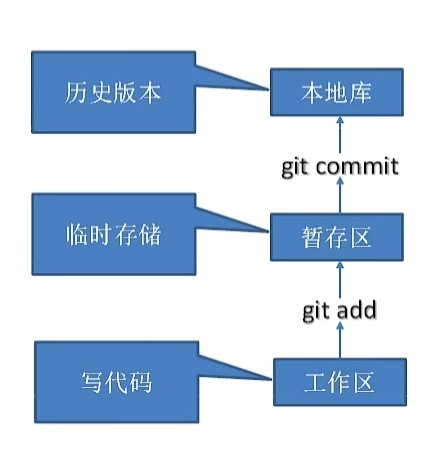
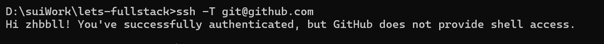

# Git教程（Windows版）

## 1 Git

### 1.1 Git介绍

#### 1.1.1 分布式版本控制工具

Git是一种分布式版本控制系统，允许每个开发者在自己的本地仓库中保存项目的完整历史记录。与集中式控制系统不同，Git无需依赖于中央服务器，开发者可以独立地创建分支、进行提交，之后再与团队成员进行代码合并。这种分布式特性使得Git在脱机情况下也能继续工作，并且更具容错性。

#### 1.1.2 集中式版本控制工具

集中式版本控制工具依赖于中央服务器来保存所有的代码及历史记录，如Subversion (SVN)。开发者必须连接到服务器才能获取代码的最新版本或进行提交。显而易见的缺点是中央服务器一旦出现故障，开发者就无法提交更新。与Git相比，集中式工具在网络不稳定时操作会受限。

#### 1.1.3 git工作机制



- **工作区 **：这是我们实际进行代码编写、修改的地方，是项目的文件夹。我们在这里对文件进行编辑、创建或删除，但这些修改还没有被Git管理，也没有被记录到版本历史中。

- **暂存区：又称“索引区”或“缓存区”。当我们使用 `git add` 命令后，文件的改动会被添加到暂存区，这意味着这些改动已被Git记录，但还没有正式提交。暂存区的作用是“暂存”修改内容，方便在提交前做进一步的检查或打包。

- **本地库 **：是Git的本地数据库，用于保存所有提交的历史记录。通过 `git commit` 命令可以将暂存区的改动提交到本地库。每次提交都会形成一个独立的版本，可以随时回溯、查看或恢复。

### 1.2 Git安装

1. 访问[Git官方网站](https://git-scm.com/)下载合适的版本。
2. 在安装过程中可以选择默认设置即可，这里不过多赘述。
3. 完成安装后，在终端中输入 `git --version` 验证安装是否成功。

### 1.3 Git常用命令


1. **设置用户签名**：`git config --global user.name <用户名> `，`git config --global user.email <邮箱>`

2. **初始化仓库**：`git init` 初始化一个新的Git仓库。即创建一个.git目录，若是使用Clone的代码自带.git所以不需要初始化。

3. **查看状态**：`git status` 查看当前文件的修改状态。

   

4. **添加文件到暂存区**：`git add <文件名>` 将文件添加到暂存区；`git add .` 添加所有修改过的文件。

5. **提交更改**：`git commit -m "提交说明"` 提交暂存区内容并附带说明。即是提交到本地主机的仓库里面。

   

6. **推送到远程仓库**：`git push` 将本地仓库中的提交记录上传到Github，使其在远程仓库（例如 Github网页）中也能显示这些改动。

   


7. **查看提交历史**：`git reflog` 查看版本信息，`git log`查看更详细的版本信息。

   

8. **回退版本**：`git reset <commit>` 这条命令将 HEAD 指针移动到指定的提交（`<commit>`）。

   

   - 实例代码中，我回退了1db771a的版本。

9. **查看差异**：`git diff` 显示文件的改动。

10. **创建标签**：`git tag <标签名>` 创建一个标签，标记重要的提交。

11. **合并分支**：`git merge <分支名>` 将指定分支的改动合并到当前分支。

### 1.4 Git分支

分支是代码开发的一个独立线索，允许你在不影响主项目（通常是 `main` 或 `master` 分支）的情况下进行更改。

每个分支都指向项目的一系列提交历史，因此可以在不同的分支上独立进行开发。

1. **创建分支**：`git branch <分支名>` 创建一个新分支。
2. **切换分支**：`git checkout <分支名>` 切换到指定分支。
3. **合并分支**：`git merge <分支名>` 将分支合并到当前分支。
4. **删除分支**：`git branch -d <分支名>` 删除本地分支。

### 1.5 冲突产生

通常发生在合并分支或进行变更时，当两个不同的分支或提交尝试修改相同的文件或相同的文件行，Git 无法自动确定应该保留哪个更改时，就会产生冲突。

#### 1.5.1冲突产生的情况

1. **合并冲突**：
   - 当尝试将两个分支合并（如使用 `git merge`）时，如果两个分支对同一文件的相同部分进行了不同的更改，Git 就会提示冲突。
   - 示例：
     - `branch A` 修改了 `file.txt` 的第 10 行。
     - `branch B` 也修改了 `file.txt` 的第 10 行。
     - 合并这两个分支时，就会产生冲突。

2. **变基冲突**：
   - 使用 `git rebase` 时，如果当前分支的提交与基底分支的提交有冲突，也会导致冲突。

3. **拉取冲突**：
   - 当使用 `git pull` 从远程仓库拉取更改时，如果本地未提交的更改与远程仓库的更改发生冲突，也会导致冲突。

#### 1.5.2如何解决冲突

当冲突发生时，Git 会在冲突文件中标记出冲突的部分。解决冲突的基本步骤如下：

1. **查看冲突文件**：使用 `git status` 查看哪些文件存在冲突。

2. **打开冲突文件**：冲突部分会标记如下：
   
   ```plaintext
   <<<<<<< HEAD
   当前分支的内容
   =======
   合并分支的内容
   >>>>>>> branch-name
   ```
   
3. **手动解决冲突**：选择保留的内容，编辑文件，删除冲突标记。

4. **标记冲突已解决**：
   
   ```bash
   git add <冲突文件>
   ```
   
5. **完成合并**：执行 `git commit` 提交合并结果。

## 2 github 使用教程

### 2.1 创建远程仓库

1. 登录GitHub，点击页面右上角的 **New** 按钮创建新仓库。
2. 填写仓库名称和描述，选择是否公开或私有，点击 **Create repository** 完成创建。

3. `git remote add` 命令用于将远程仓库添加到本地 Git 项目中。这样可以将本地的更改推送到远程仓库，或从远程仓库拉取最新的更新。

   ```bash
   git remote add <远程名称> <远程仓库URL>
   ```

   - `<远程名称>`：是为远程仓库设置的别名，通常为 `origin`。

   - `<远程仓库URL>`：是远程仓库的地址，支持多种协议，例如 HTTPS 或 SSH。

### 2.2 代码推送 Push

1. 使用 `git remote add origin <远程仓库地址>` 连接本地仓库和GitHub远程仓库。
2. 使用 `git push origin <分支名>` 将本地分支代码推送到GitHub。

### 2.3 代码拉取 Pull

在团队协作中需要获取最新代码时使用`git pull origin <分支名>`，此命令会同步远程仓库中的更新。每一次进行push之前应该执行pull，会将远程仓库的最新更改合并到本地，能提前发现冲突。在本地处理冲突比推送失败后再解决更容易，避免在团队协作中因为冲突而影响他人工作。

### 2.4 代码克隆 Clone

通过 `git clone <远程仓库地址>` 下载GitHub远程仓库到本地，便于后续修改和提交。

### 2.5 代码提交审查（PR）

PR 提交后，项目的其他协作者可以查看代码变更，提出改进意见或建议。


如图中点击之后，点击create pull request进行后序操作即可提交。

### 2.6 SSH免密登录

使用 SSH 可以免去输入用户名和密码，安全、便捷地连接到远程 Git 仓库。

#### 2.6.1 生成 SSH 密钥

如果没有 SSH 密钥，可以使用以下命令生成一对新的 SSH 密钥：

```bash
ssh-keygen -t rsa -b 4096 -C "your_email@example.com"
```

- `-t rsa -b 4096`：指定加密类型和密钥长度。
- `-C "your_email@example.com"`：用于备注邮箱（可以是 GitHub 账户的邮箱）。

命令运行后，按提示选择保存位置（默认是 `~/.ssh/id_rsa`）并设置一个密码短语（可选），系统会生成两个文件：
- **公钥**：`id_rsa.pub`，需要将其添加到远程仓库。
- **私钥**：`id_rsa`，用于身份验证，请妥善保管，不要分享。

#### 2.6.2 将 SSH 公钥添加到远程仓库

1. 打开公钥文件，复制公钥内容：
   ```bash
   cat ~/.ssh/id_rsa.pub
   ```

2. 前往 GitHub 或 GitLab 等代码托管平台，找到 **SSH Keys** 添加页面。
   - GitHub：前往 **Settings > SSH and GPG keys > New SSH key**。
   - GitLab：前往 **Preferences > SSH Keys**。

3. 在“Key”框中粘贴你的公钥内容，并保存。

#### 2.6.3 测试 SSH 连接

确保公钥已添加到远程仓库后，可以使用以下命令测试是否连接成功：

```bash
ssh -T git@github.com
```

如果成功连接，将看到类似以下信息：



#### 2.6.4 使用 SSH 克隆仓库

在 SSH 设置成功后，可以通过 SSH 地址克隆仓库，无需每次输入用户名和密码：

```bash
git clone git@github.com:<username>/<repository>.git
```

#### 2.6.5 配置 Git 使用 SSH URL

可以配置 Git 使用 SSH 而不是 HTTPS 来访问仓库，特别是在拉取和推送时：

```bash
git remote set-url origin git@github.com:<username>/<repository>.git
```

