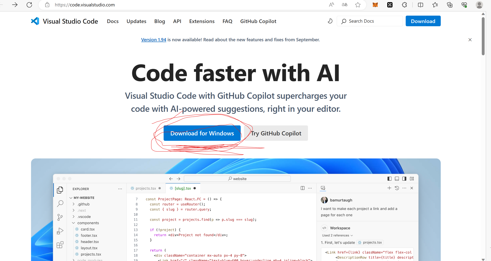

# VSCode 下载指南

**Visual Studio Code (VSCode)** 是一款流行的开源代码编辑器，广泛应用于编程和开发工作。它支持多种编程语言，具有丰富的扩展库和自定义功能，是开发者的得力工具。本文将提供从官网下载并安装 VSCode 的详细步骤。

## 第一步：访问 VSCode 官网

1. 打开浏览器，访问 [Visual Studio Code 官方网站](https://code.visualstudio.com/)。

2. 点击页面上的 **Download** 按钮，进入下载页面。

   

## 第二步：选择操作系统版本

在下载页面，可以看到不同操作系统的下载选项。VSCode 支持 **Windows**、**macOS** 和 **Linux** 操作系统：

- **Windows**：我使用的是 Windows 系统，选择 **Windows** 下载链接。通常提供 EXE 安装文件，支持 Windows 10 及以上版本。

## 第三步：安装 VSCode

下载完成后，运行安装文件并根据提示完成安装。

- **Windows** 用户双击 .exe 文件，按提示完成安装过程。

## 第四步：安装扩展插件

VSCode 的强大功能之一是支持扩展插件。可以在侧边栏点击扩展按钮（四方形图标）。

1. 简体中文语言包：对不熟悉VScode的萌新非常友好

   

2. WSL：Windows目前自带Linux子系统，在软件商店下载Ubuntu即可使用Linux。加上这个插件可以在VScode连接Ubuntu，提高开发效率。

