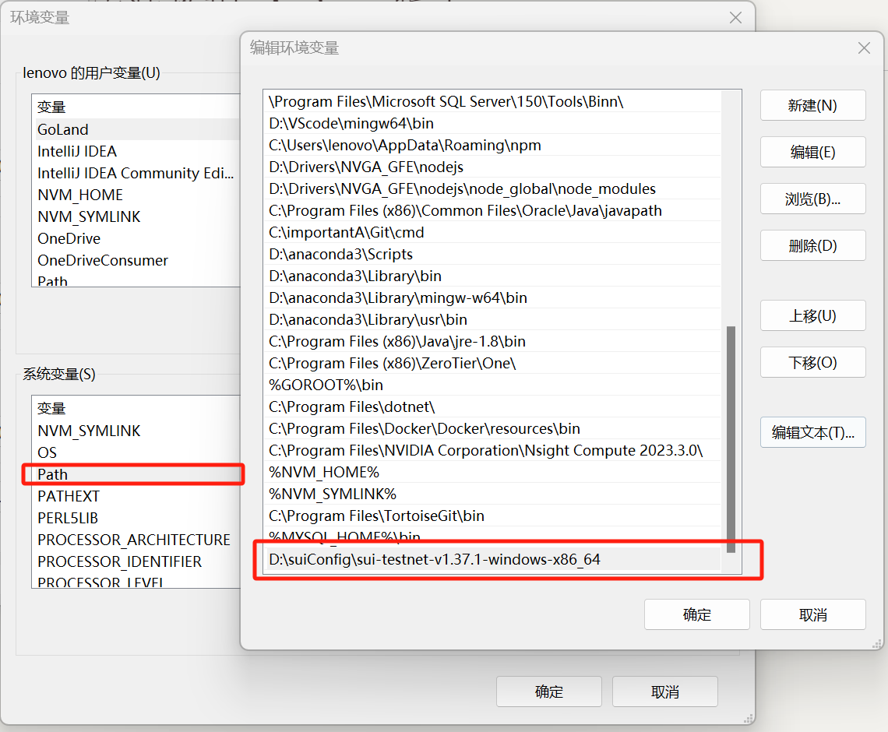
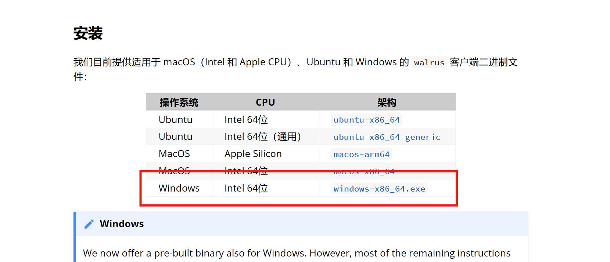
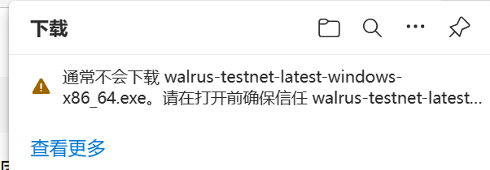
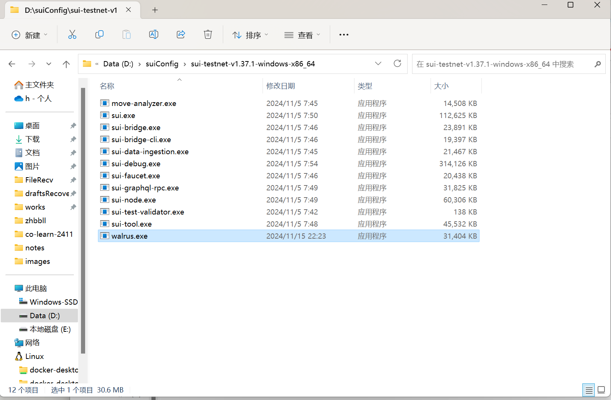
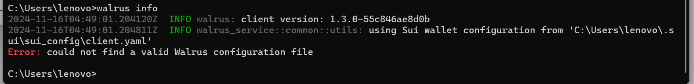
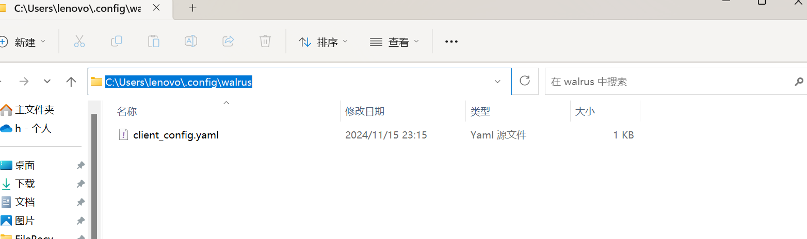
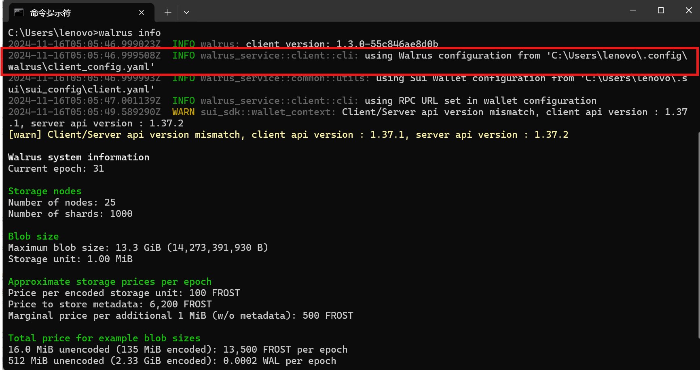

# walrus安装教程windows版本

## 1 前提是安装sui-cli

安装完成之后配置的环境变量为



## 2.  安装walrus

进入网址[设置 - Walrus ](https://docs-zh.walrus.site/usage/setup.html)选择安装windows版本的客户端二进制



如果遇到以下类似问题



尝试切换浏览器即可解决问题

下载完成之后文件名为walrus-testnet-latest-windows-x86_64.exe，（注意如果看不到.exe后缀需要去开启后缀名显示），然后将名称改为walrus.exe

然后将修改完的这个二进制文件移至之前我们sui环境变量的目录下面



然后进入命令行输入`walrus --help`，出现内容不报错说明安装成功。

## 3 配置walrus

输入`walrus info` 出现错误



提示找不到有效的walrus配置文件

我们需要找到用户下的`.config`文件，创建一个walrus目录，在目录中新建一个`client_config.yaml`文件,，如下：



内容输入：

```yaml
system_object: 0x50b84b68eb9da4c6d904a929f43638481c09c03be6274b8569778fe085c1590d
staking_object: 0x37c0e4d7b36a2f64d51bba262a1791f844cfd88f31379f1b7c04244061d43914
exchange_object: 0x0e60a946a527902c90bbc71240435728cd6dc26b9e8debc69f09b71671c3029b
```

然后重启命令行，输入`walrus info`:



可以看到walrus成功使用了我们设置的配置。

至此walrus就成功安好了。可进一步使用`walrus get-wal`等指令，具体请参照官方文档。