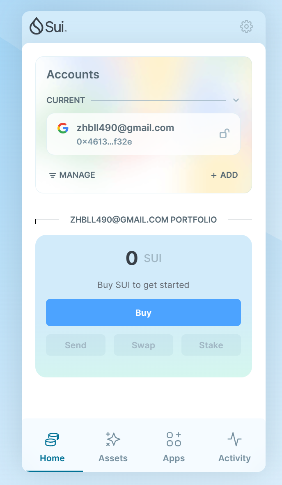

## 基本信息
- Sui钱包地址: `0x461305712cc57b27e3b3dfb301564ae538f800a87d695eb8e9cab52a8c1cf32e`
> 首次参与需要完成第一个任务注册好钱包地址才被合并，并且后续学习奖励会打入这个地址
- githubId: `zhbbll`

## 个人简介
- 职业：学生
> 重要提示 请认真写自己的简介
- 对web3有一定程度上的了解，乐此不疲
- 联系方式: qq2779265609

## 任务

##   01 hello move  
- [] Sui cli version: sui 1.29.2
- [] Sui钱包截图: 
- [] package id: 0x53a6a991fa49d71d6bbbbf634804aaf30f11084a369cb0bf065e19e128f20889
- [] package id 在 scan上的查看截图:

##   02 move coin
- [] My Coin package id : 
- [] Faucet package id : 
- [] 转账 `My Coin` hash: 
- [] `Faucet Coin` address1 mint hash: 
- [] `Faucet Coin` address2 mint hash: 

##   03 move NFT
- [] nft package id :
- [] nft object id : 
- [] 转账 nft  hash:
- [] scan上的NFT截图:

##   04 Move Game
- [] game package id :
- [] deposit Coin hash:
- [] withdraw `Coin` hash:
- [] play game hash:

##   05 Move Swap
- [] swap package id :
- [] call swap CoinA-> CoinB  hash :
- [] call swap CoinB-> CoinA  hash :

##   06 Dapp-kit SDK PTB
- [] save hash :

##   07 Move CTF Check In
- [] CLI call 截图 : 
- [] flag hash :

##   08 Move CTF Lets Move
- [] proof : 
- [] flag hash :