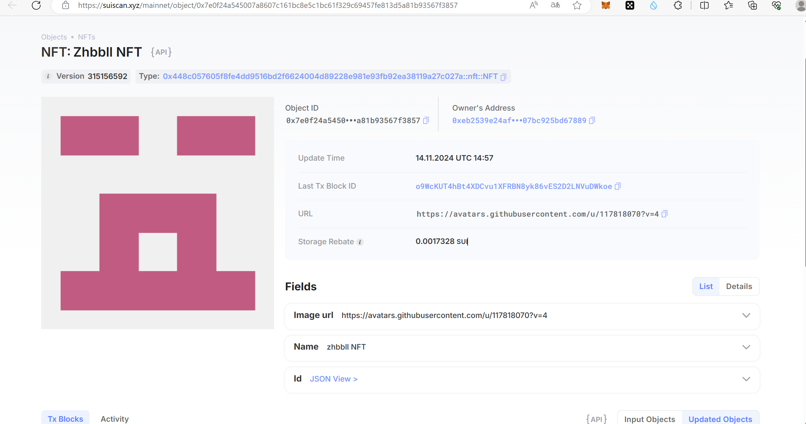

## 基本信息
- Sui钱包地址: `0x461305712cc57b27e3b3dfb301564ae538f800a87d695eb8e9cab52a8c1cf32e`
> 首次参与需要完成第一个任务注册好钱包地址才被合并，并且后续学习奖励会打入这个地址
- githubId: `zhbbll`

## 个人简介
- 职业：学生
> 重要提示 请认真写自己的简介
- 对web3有一定程度上的了解，乐此不疲
- 联系方式: qq2779265609

## 任务

##   01 hello move

- [x] Sui cli version: sui 1.29.2
- [x] Sui钱包截图: 
- [x] package id: 0x53a6a991fa49d71d6bbbbf634804aaf30f11084a369cb0bf065e19e128f20889
- [x] package id 在 scan上的查看截图:

##   02 move coin

- [x] My Coin package id : 0x7e15b359c7fb72be1f6467c9c3db1f216b6e5b72eb7b4a259ff896ad4fcf508f
- [x] Faucet package id : 0xe7366828123241f6ec15bbd77b03a02bbe308ab9d95781c6bb82d3f66ea5e444
- [x] 转账 `My Coin` hash: 0x7b8e0864967427679b4e129f79dc332a885c6087ec9e187b53451a9006ee15f2
- [x] `Faucet Coin` address1 mint hash: 5LpE55MgqcMhgYBbaDWeeeAYtg5PUetXyZBKiPhdzEcM
- [x] `Faucet Coin` address2 mint hash: BfTEbTJ81fsY6o8eeV3z1JEDgsA2D9bjKBzJpH4fqeC5

##   03 move NFT

- [x] nft package id :0x448c057605f8fe4dd9516bd2f6624004d89228e981e93fb92ea38119a27c027a
- [x] nft object id : 0x7e0f24a545007a8607c161bc8e5c1bc61f329c69457fe813d5a81b93567f3857
- [x] 转账 nft  hash:BMJ8mAhYrqpULDK8X9VQHkT9yLVMyCZrpW4WszH5fZrb
- [x] scan上的NFT截图: 

##   04 Move Game

- [x] game package id :0x69f6ef8ea978d3ec95113948798d33f7a8710c5f604b0016c575b030f6d4f30b
- [x] deposit Coin hash:9AV9bkPEPc6PWnByzJsBXAqkUs8HeBUZ7TEEzLU8iLRK
- [x] withdraw `Coin` hash:4T9nxbZ98qBjxZJahVxHNVkbVRi9RibUTCHH3iWUWxzC
- [x] play game hash:7zMP2LHcchNTQXQKh5fVeuuH8uh1TJ2nq4jKcneiLsfD

##   05 Move Swap

- [x] swap package id : 0x302c31c249ba3c812342f5f72136e5708b390b739ff93d7ad3bf7814c2c3202b
- [x] call swap CoinA-> CoinB  hash : 3PRDNA3YMYWYBVxALuSvykhePFPuWAZPAQyR1mq6fWwS
- [x] call swap CoinB-> CoinA  hash : BnyHKB8iMBEQCgtZwf7PuDPim96jrH9h6AWrvnM7qMAn

##   06 Dapp-kit SDK PTB

- [x] save hash : paVeTgCK6RAqWpFNPfMQYEg9XbFTyhHcMnhFsT9g5Yw

##   07 Move CTF Check In

- [] CLI call 截图 : 
- [] flag hash :

##   08 Move CTF Lets Move
- [] proof : 
- [] flag hash :