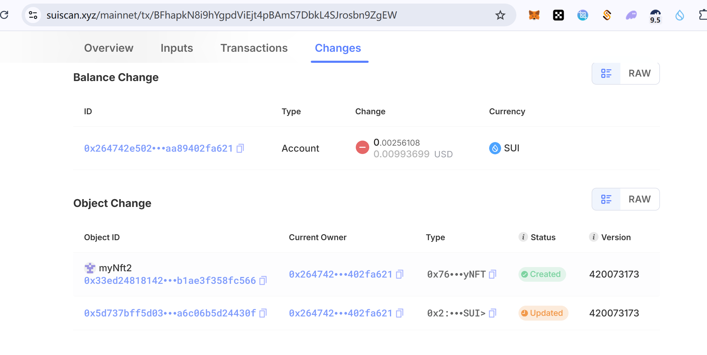

## 基本信息
- Sui钱包地址: `0x264742e5020aafcb51f214513f1b7d5ce7eb2d6473c9b47f1343aa89402fa621`
> 首次参与需要完成第一个任务注册好钱包地址才被合并，并且后续学习奖励会打入这个地址
- github: `zhtkeepup`

## 个人简介
- 工作经验: 10年
- 技术栈: `solidity` `java` `js` `Rust` `sql`
> 重要提示 请认真写自己的简介
- 偏后端的全栈开发者
- 联系方式: tg: `zhtkeepup` 

## 任务

##   01 hello move  
- [] Sui cli version: sui 1.37.3-homebrew
- [] Sui钱包截图: 
- [] package id: 0xc1b082a9e8660a90d221d986883fb328815555b42eebdf8f1c78a2a1426ff4c4
- [] package id 在 scan上的查看截图:
### 其他截图, b站关注与github star:
1: 
2: 

##   02 move coin
(在同一个package里同时包含Faucet Coin和My Coin, 因此两个id是一样的.)
- [] My Coin package id : 0x0b0b06cc47146f8d4f0db905dc1492354169ae416c78d371e14f0d13c8876836
- [] Faucet package id : 0x0b0b06cc47146f8d4f0db905dc1492354169ae416c78d371e14f0d13c8876836
- [] 转账 `My Coin` hash: (mint_and_transfer) 4bR3X9rdtL19FhLnepvqqy3pTDaXVyRaubi9ZKS36fKd
- [] `Faucet Coin` address1 mint hash: 89ur8P58qYAhQrQhQY4XVQpAJqSdghKKQR2WzAz6daAH
- [] `Faucet Coin` address2 mint hash: 4ySXL9qT1smLQ4YErpFV4GvFUXac9zKtUAhgn3pLhGGQ

##   03 move NFT
- [] nft package id : 0x76c65ad4cbf1a0fac148ba88e15b2d542b5c151a970601a81f889faa09bc336e
- [] nft object id : (mint给自己的nft obj id) 0x33ed248181429a6b7c0d1c1f1ce05d3ba602e7da346100109fb1ae3f358fc566
- [] 转账 nft  hash: (直接mint给uvd的nft的hash)  Bu41bE6eqMYszj1v12mojoGrTKF2eBKnU9Pgbuy8amN8
- [] scan上的NFT截图:

##   04 Move Game
- [] game package id :
- [] deposit Coin hash:
- [] withdraw `Coin` hash:
- [] play game hash:

##   05 Move Swap
- [] swap package id :
- [] call swap CoinA-> CoinB  hash :
- [] call swap CoinB-> CoinA  hash :

##   06 Dapp-kit SDK PTB
- [] save hash :

##   07 Move CTF Check In
- [] CLI call 截图 : 
- [] flag hash :

##   08 Move CTF Lets Move
- [] proof : 
- [] flag hash :

