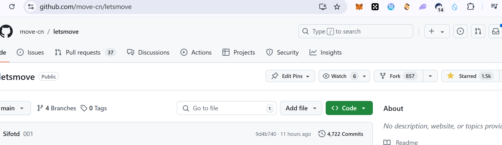

## 基本信息

-   Sui 钱包地址: `0x264742e5020aafcb51f214513f1b7d5ce7eb2d6473c9b47f1343aa89402fa621`
    > 首次参与需要完成第一个任务注册好钱包地址才被合并，并且后续学习奖励会打入这个地址
-   github: `zhtkeepup`

## 个人简介

-   工作经验: 10 年
-   技术栈: `solidity` `java` `js` `Rust` `sql`
    > 重要提示 请认真写自己的简介
-   偏后端的全栈开发者
-   联系方式: tg: `zhtkeepup`

## 任务

## 01 hello move

-   [✓] Sui cli version: sui 1.37.3-homebrew
-   [✓] Sui 钱包截图: 
-   [✓] package id: 0xc1b082a9e8660a90d221d986883fb328815555b42eebdf8f1c78a2a1426ff4c4
-   [✓] package id 在 scan 上的查看截图:

### 其他截图, b 站关注与 github star:

[✓] 1: 
[✓] 2: 

## 02 move coin

(在同一个 package 里同时包含 Faucet Coin 和 My Coin, 因此两个 id 是一样的.)

-   [✓] My Coin package id : 0x0b0b06cc47146f8d4f0db905dc1492354169ae416c78d371e14f0d13c8876836
-   [✓] Faucet package id : 0x0b0b06cc47146f8d4f0db905dc1492354169ae416c78d371e14f0d13c8876836
-   [✓] 转账 `My Coin` hash: (mint_and_transfer) 4bR3X9rdtL19FhLnepvqqy3pTDaXVyRaubi9ZKS36fKd
-   [✓] `Faucet Coin` address1 mint hash: 89ur8P58qYAhQrQhQY4XVQpAJqSdghKKQR2WzAz6daAH
-   [✓] `Faucet Coin` address2 mint hash: 4ySXL9qT1smLQ4YErpFV4GvFUXac9zKtUAhgn3pLhGGQ

## 03 move NFT

-   [✓] nft package id : 0x76c65ad4cbf1a0fac148ba88e15b2d542b5c151a970601a81f889faa09bc336e
-   [✓] nft object id : (mint 给自己的 nft obj id) 0x33ed248181429a6b7c0d1c1f1ce05d3ba602e7da346100109fb1ae3f358fc566
-   [✓] 转账 nft hash: (直接 mint 给 uvd 的 nft 的 hash) Bu41bE6eqMYszj1v12mojoGrTKF2eBKnU9Pgbuy8amN8
-   [✓] scan 上的 NFT 截图:

## 04 Move Game

-   [] game package id :
-   [] deposit Coin hash:
-   [] withdraw `Coin` hash:
-   [] play game hash:

## 05 Move Swap

-   [] swap package id :
-   [] call swap CoinA-> CoinB hash :
-   [] call swap CoinB-> CoinA hash :

## 06 Dapp-kit SDK PTB

-   [] save hash :

## 07 Move CTF Check In

-   [] CLI call 截图 : 
-   [] flag hash :

## 08 Move CTF Lets Move

-   [] proof :
-   [] flag hash :
