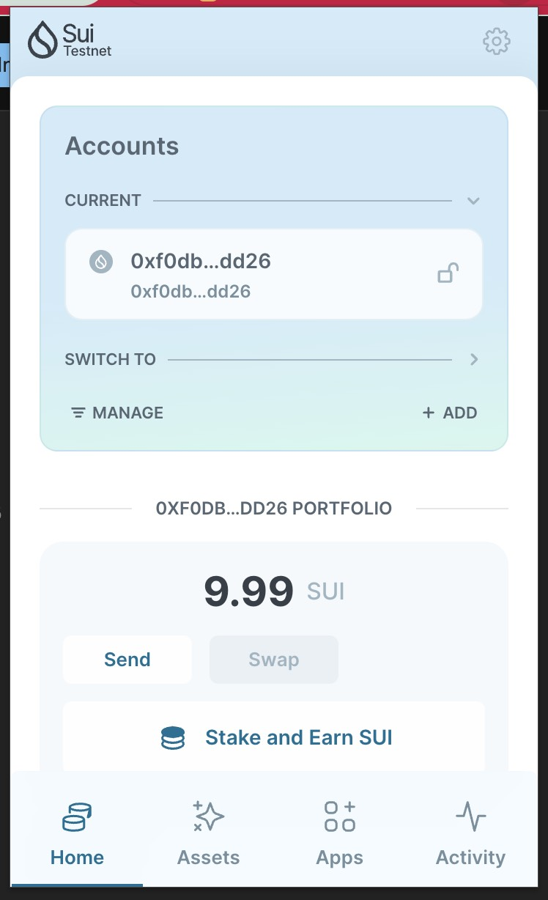
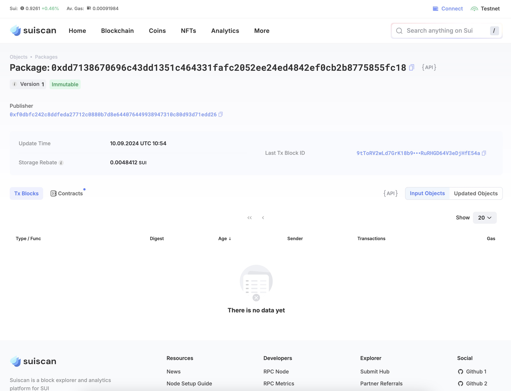

## 基本信息
- Sui钱包地址: `0xf0dbfc242c8ddfeda27712c0880b7d8e644076449938947310c80d93d71edd26`
> 首次参与需要完成第一个任务注册好钱包地址才被合并，并且后续学习奖励会打入这个地址
- github: `zhuaiballl`

## 个人简介
- 工作经验: 0年
- 技术栈: `Rust` `C++` `Golang` `Java`
> 重要提示 请认真写自己的简介
- 区块链研究人员，主要研究方向是去中心化存储
- 联系方式: tg: `zhuaiballl` 

## 任务

##   01 hello move  
- [] Sui cli version: 1.32.0-homebrew
- [] Sui钱包截图: 
- [] package id: 0xdd7138670696c43dd1351c464331fafc2052ee24ed4842ef0cb2b8775855fc18
- [] package id 在 scan上的查看截图:

##   02 move coin
- [] My Coin package id : 0xf756d9e1aeb6efae5a43ee6aff6f2870fc23d7f9bde21828449542fdcd71c68c
- [] Faucet package id : 0xd76554787954b5e0394cdfbe15a0eb788305adfd59228d3141b57c40331d6949
- [] 转账 `My Coin` hash: HAbzKAShdAkjkKrX8GW5Lmwb3tbN5ESTAUeFYhkFc8o1
- [] `Faucet Coin` address1 mint hash: DwGCqcqUybbrPM9aQAH8tJGzxh5N7bw6KP5rwUzveBhp
- [] `Faucet Coin` address2 mint hash: A24v3zVU8YfLEnADfsFd8khr5jY1Bn2pPo2NBj5tcV35

##   03 move NFT
- [] nft package id :
- [] nft object id : 
- [] 转账 nft  hash:
- [] scan上的NFT截图:

##   04 Move Game
- [] game package id :
- [] deposit Coin hash:
- [] withdraw `Coin` hash:
- [] play game hash:

##   05 Move Swap
- [] swap package id :
- [] call swap CoinA-> CoinB  hash :
- [] call swap CoinB-> CoinA  hash :

##   06 Dapp-kit SDK PTB
- [] save hash :

##   07 Move CTF Check In
- [] CLI call 截图 : 
- [] flag hash :

##   08 Move CTF Lets Move
- [] proof : 
- [] flag hash :
