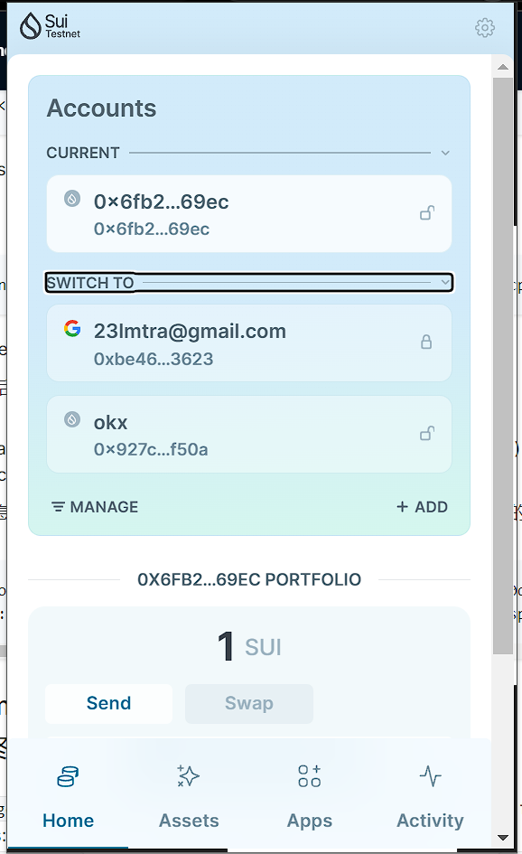
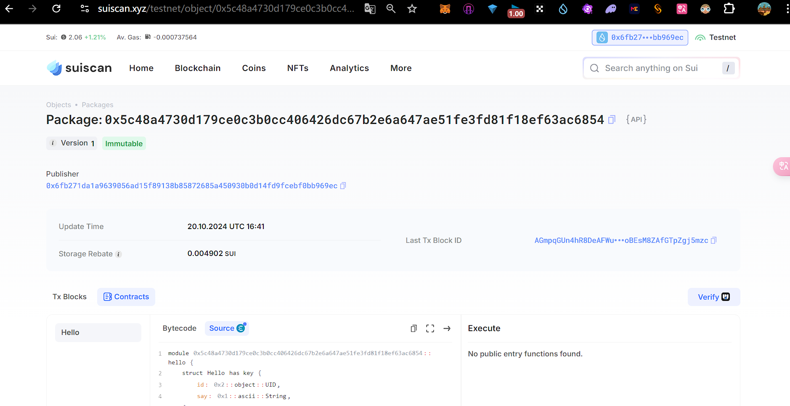

## 基本信息

- Sui 钱包地址: `0x927cbe9238121ab71cacc49cee5d08b3028841c96bd9fd23b766ec549ce9f50a`
  > 首次参与需要完成第一个任务注册好钱包地址才被合并，并且后续学习奖励会打入这个地址
- github: `zimblu`

## 个人简介

- 工作经验: 无
- 技术栈: `Rust` `Golang`
  > 重要提示 请认真写自己的简介
- 对 Move 特别感兴趣，想通过 Move 入门区块链
- 联系方式: tg: `https://t.me/Alaricdoteth`

## 任务

## 01 hello move

- [] Sui cli version: sui 1.35.2-4e46da89efd5
- [] Sui 钱包截图: 
- [] package id: 0x5c48a4730d179ce0c3b0cc406426dc67b2e6a647ae51fe3fd81f18ef63ac6854
- [] package id 在 scan 上的查看截图:

## 02 move coin

- [] My Coin package id : 0xcfbdcdefce6bdf78cad1d90523fb91b2f5f46fc1b09531339931059114f6804b
- [] Faucet package id : 0xcfbdcdefce6bdf78cad1d90523fb91b2f5f46fc1b09531339931059114f6804b
- [] 转账 `My Coin` hash: J6GH4Ss97y8MPYcqBCNU1HUe22SQRkCek5a4YqcgKgi4
- [] `Faucet Coin` address1 mint hash: kkpxBaUUvas58fbRqDTs4uxSMkXGUogXLG4G6Zdu87p
- [] `Faucet Coin` address2 mint hash: 5WzvdPyjGjcm22SuUdJqzSmVUnBKfXnY8woi3oEREDAy

## 03 move NFT

- [] nft package id : 0x7f3762aac4abcf0ded15f6dea4b357908c9b209ae22f385f0f2face667ff925b
- [] nft object id : 0xb8d913d8732c396362cd1d372824db6e08146bfad2f0e51e7f0b656250fb9099
- [] 转账 nft hash: 9t254cwh113PfjZSGWMGyLYsuZWnMN5ZLpLZZDntWLsa
- [] scan 上的 NFT 截图:

## 04 Move Game

- [] game package id :
- [] deposit Coin hash:
- [] withdraw `Coin` hash:
- [] play game hash:

## 05 Move Swap

- [] swap package id :
- [] call swap CoinA-> CoinB hash :
- [] call swap CoinB-> CoinA hash :

## 06 Dapp-kit SDK PTB

- [] save hash :

## 07 Move CTF Check In

- [] CLI call 截图 : 
- [] flag hash :

## 08 Move CTF Lets Move

- [] proof :
- [] flag hash :
