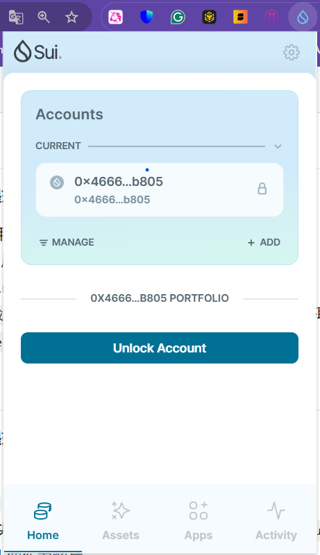
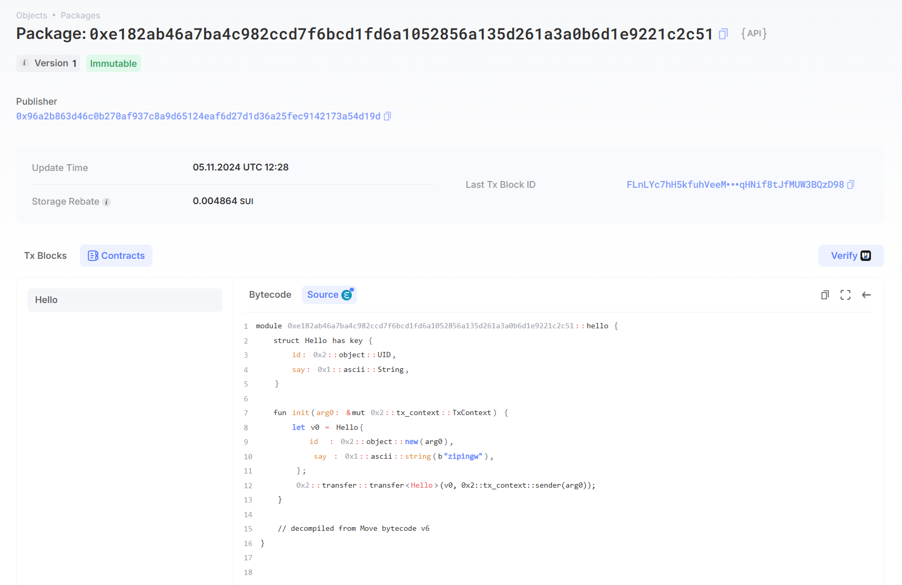

## 基本信息
- Sui钱包地址: `0x46665820950457b0f8e5e5d9ba18fc82bc3441916bf9a5c812e058aa2ad9b805`
> 首次参与需要完成第一个任务注册好钱包地址才被合并，并且后续学习奖励会打入这个地址
- github: `zipingw`

## 个人简介
- 浙江大学硕士研究生二年级在读
- 技术栈:  `Python` `Java` `C++` `Solidity`
> 重要提示 请认真写自己的简介
- 计算机科班出身，计算机基础扎实，AI、Web3双修，相信Web3是和互联网一样改变世界的技术

- 目前在浙江大学Emnets实验室，主要研究方向：区块链+物联网交叉领域

- 英文水平：**CET-4**: 548，**CET-6**: 505

- 专业知识：

  **1.** 熟悉数据结构、计算机网络、计算机组成、操作系统、数据库等计算机基础知识。

  **2.** 了解比特币、以太坊底层原理（如共识协议、Merkle Tree、MPT）；

  **3.** 关注Web3生态中的商业版图：Layer1公链、Layer2扩容、钱包、交易所、DePIN、DeFi、NFT、DAO、SocialFi；对Web3的商业逻辑有较清晰的认知。

- 开发能力：

  **1.** 熟练使用Linux系统，熟悉SSH、Tmux、Vim、Git、MySQL、Thrift、Docker。

  **2.** 熟练使用 Python、C++、JAVA语言，会简单使用Golang、Solidity、JavaScript。

  **3.** 熟悉后端框架Django、Spring Boot；熟悉Dapp架构与开发流程。

  **4.** 熟悉Tensorflow、Pytorch框架。

- 项目经历：

  - **基于树莓派的健身管理系统**  **2020.11-2022.01**

    - **项目简介：**实现系统如下：用户通过微信小程序扫描健身器械二维码，启动健身器械搭载的树莓派4B的运动识别算法，对用户的运动进行计数并保留历史运动数据。

    - **技术点：**

      **1.** 在树莓派4B上开发运动识别算法。

      **2.** 开发微信小程序实现前端界面。

      **3.** 在阿里云服务器上实现后端负责实现树莓派4B与微信小程序的通信。

  - **基于网络科学的以太坊钓鱼账户检测** **2022.03-2022.05**  **2020.11-2022.01**

    - **项目简介：**针对目前加密货币领域的诈骗行为(如庞氏骗局)，通过分析Ethereum上的交易数据识别钓鱼账户。

    - **技术点：**

      **1.** 特征工程：将交易数据构建成图数据结构，通过手工特征与图随机游走等方法对账户进行特征提取。

      **2.** 模型训练与预测：采用异常检测、机器学习、图神经网络对以太坊账户进行分类。

    - **成果：**实验结果中集成学习模型 LightGBM 表现结果最佳，达到85.6%左右的F1-score。

  - **面向图像表示模型的知识蒸馏算法研究（本科毕设）** **2023.01-2023.05**

    - **项目简介：**此前的知识蒸馏方法主要针对深度分类模型，因而无法将现有知识蒸馏算法直接应用于图像表示模型。本课题研究面向图像表示模型的知识蒸馏算法。Github地址 https://github.com/zipingw/Knowledge-Distillation

    - **创新点：**

      **1.** 针对图像表示模型缺失线性分类层，引入对比损失函数InfoNCE用于表示层知识蒸馏；

      **2.** 将基于注意力机制的中间层软匹配方法与基于注意力图的中间层知识蒸馏方法相结合；

      **3.** 引入数据增强，提高知识蒸馏效果。

    - **成果：**所设计知识蒸馏算法能够有效保留**图像表示模型** 的模型性能并减少模型参数量。

  - 联系方式: tg: `@kayneK` 

## 任务

##   01 hello move  
- [] Sui cli version: sui 1.37.1-7839b9501066
- [] Sui钱包截图: 
- [] package id: 0xe182ab46a7ba4c982ccd7f6bcd1fd6a1052856a135d261a3a0b6d1e9221c2c51
- [] package id 在 scan上的查看截图:

##   02 move coin
- [] My Coin package id : 
- [] Faucet package id : 
- [] 转账 `My Coin` hash:
- [] `Faucet Coin` address1 mint hash:
- [] `Faucet Coin` address2 mint hash:

##   03 move NFT
- [] nft package id :
- [] nft object id : 
- [] 转账 nft  hash:
- [] scan上的NFT截图:

##   04 Move Game
- [] game package id :
- [] deposit Coin hash:
- [] withdraw `Coin` hash:
- [] play game hash:

##   05 Move Swap
- [] swap package id :
- [] call swap CoinA-> CoinB  hash :
- [] call swap CoinB-> CoinA  hash :

##   06 Dapp-kit SDK PTB
- [] save hash :

##   07 Move CTF Check In
- [] CLI call 截图 : 
- [] flag hash :

##   08 Move CTF Lets Move
- [] proof : 
- [] flag hash :
