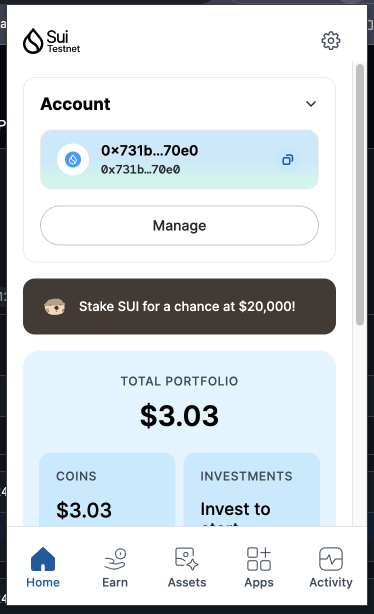
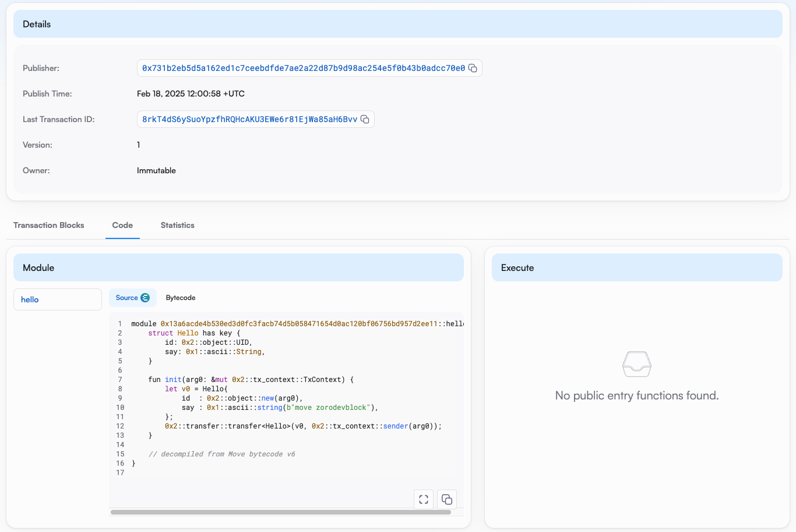

## 基本信息
- Sui钱包地址: `0x731b2eb5d5a162ed1c7ceebdfde7ae2a22d87b9d98ac254e5f0b43b0adcc70e0`
- github: `zorodevblock`

## 个人简介
- 工作经验: 9年
- 技术栈: `Objective-c` `Swift` `Flutter` `React` `Nextjs` `Python` `Move`
- 多年web2移动端开发经验，对区块链和智能合约方向感兴趣，想通过Move入门区块链
- 联系方式: email: `zorodev.block@gmail.com` 

## 任务

##   01 hello move  
- [x] Sui cli version: sui 1.43.0-bd272b07244d
- [x] Sui钱包截图: 
- [x] package id: 0x13a6acde4b530ed3d0fc3facb74d5b058471654d0ac120bf06756bd957d2ee11
- [x] package id 在 scan上的查看截图:

##   02 move coin
- [] My Coin package id : 
- [] Faucet package id : 
- [] 转账 `My Coin` hash:
- [] `Faucet Coin` address1 mint hash:
- [] `Faucet Coin` address2 mint hash:

##   03 move NFT
- [] nft package id :
- [] nft object id : 
- [] 转账 nft  hash:
- [] scan上的NFT截图:

##   04 Move Game
- [] game package id :
- [] deposit Coin hash:
- [] withdraw `Coin` hash:
- [] play game hash:

##   05 Move Swap
- [] swap package id :
- [] call swap CoinA-> CoinB  hash :
- [] call swap CoinB-> CoinA  hash :

##   06 Dapp-kit SDK PTB
- [] save hash :

##   07 Move CTF Check In
- [] CLI call 截图 : 
- [] flag hash :

##   08 Move CTF Lets Move
- [] proof : 
- [] flag hash :

