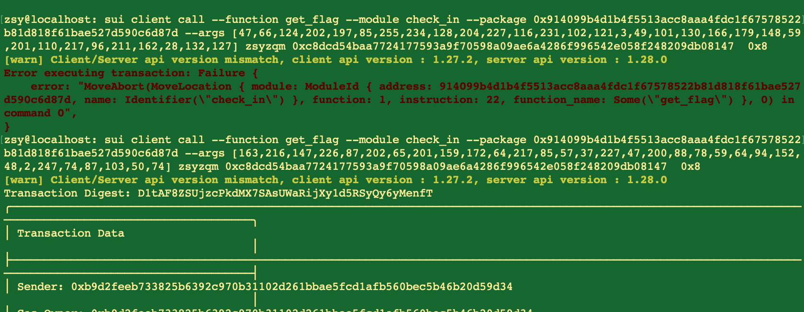

## 基本信息
- Sui钱包地址: `0xb9d2feeb733825b6392c970b31102d261bbae5fcd1afb560bec5b46b20d59d34`
> 首次参与需要完成第一个任务注册好钱包地址才被合并，并且后续学习奖励会打入这个地址
- github: `zsyzqm`

## 个人简介
- 工作经验: 1年
- 技术栈: `Java` `SQL`

## 任务

##   01 hello move  
- [x] package id: `0xaec7eb10cbaa1191a181718872e7097c09f50cef823fd778a6636bdcae2df7e9`

### 02 move coin

- [x] My Coin package id: `0x4735ae94f2de2d1fdb838d128a474cb452df34b7e78d39e761ed7367f5494ec8`
- [x] Faucet package id: `0x4735ae94f2de2d1fdb838d128a474cb452df34b7e78d39e761ed7367f5494ec8`
- [x] 转账 `My Coin` hash: `ByEzhfakNt5CPNweNg8wHaMswE2SjXv2Vr2xKWBLqLrq`

##   03 move NFT
- [x] nft package id : `0xdcdeb51239485817ca52cf600b230395f994c477a601fb3fc8266981f3d528a2  `
- [x] nft object id : `0x1ac3db135a8227771ce199cccda847b8cbc53653dde3b972364953278ef641b4`
- [x] 转账 nft digest hash: `Fzecqm82ypKoCC1hVRSDnz5C9XJJwZUBXKFNCQevhmum`

### 04 Move Game

- [x] game package id: `0xa2874e97adeca0785c13b5c404bc0698eb69fcb19c73b792c235c8cfe2a64f9d`
- [x] call game digest hash: `9oEitjXcNaab5FQEjBwrsAH9cpfYSWyMkQckqziqp85V`

### 05 Move Swap

- [x] swap package id: `0x1a666dd5ef78c8351826510f7e25b164bc42eb5336672fb24502e6ed173521e6`
- [x] call swap hash: `GvEF8b1krgUxb5jJ7bBToBz4MbjAqV9w5j1JxvX4ZYV6`

##   06 SDK PTB
- [x] save hash: `A35K6RPk8ct77U2jNdjFf6iELxTRyxH1A7TU4g8y9Cxo`

##   07 Move CTF Check In
- [x] CLI call 截图 : 
- [x] flag hash : D1tAF8ZSUjzcPkdMX7SAsUWaRijXy1d5RSyQy6yMenfT

##   08 Move CTF Lets Move
- [x] proof : cbd344ce56c373c20139
- [x] flag hash : 2v9kaPZ1yC8CuBtZJSCXpyqUg2rzuNiKXPFv6f2tzqYw
