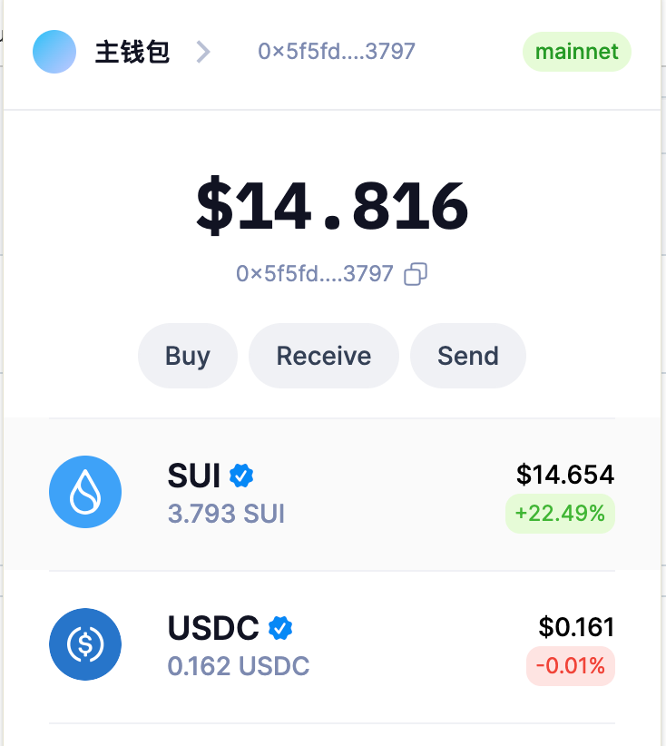
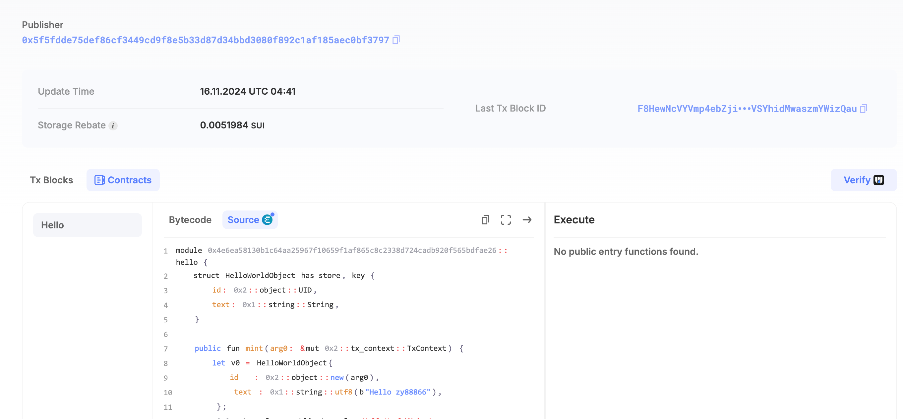

## 基本信息
- Sui钱包地址: `0x5f5fdde75def86cf3449cd9f8e5b33d87d34bbd3080f892c1af185aec0bf3797`
> 首次参与需要完成第一个任务注册好钱包地址才被合并，并且后续学习奖励会打入这个地址
- github: `zy88866`

## 个人简介
- 工作经验: 5年
- 技术栈: `Java` `Solidity` `Vue`
- 5年web2开发经验，1年智能合约开发经验 对Move特别感兴趣，想深入学习Move
- 联系方式: tg: `@zy88686` 

## 任务

##  01 hello move
- [] Sui cli version: sui 1.37.1
- [] Sui钱包截图: 
- [] package id: 0x4e6ea58130b1c64aa25967f10659f1af865c8c2338d724cadb920f565bdfae26
- [] package id 在 scan上的查看截图:  

### 02 move coin

##   03 move NFT

### 04 Move Game

### 05 Move Swap

##   06 SDK PTB

##   07 Move CTF Check In

##   08 Move CTF Lets Move

