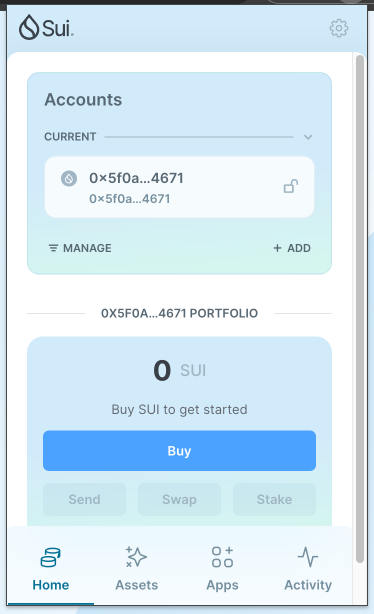
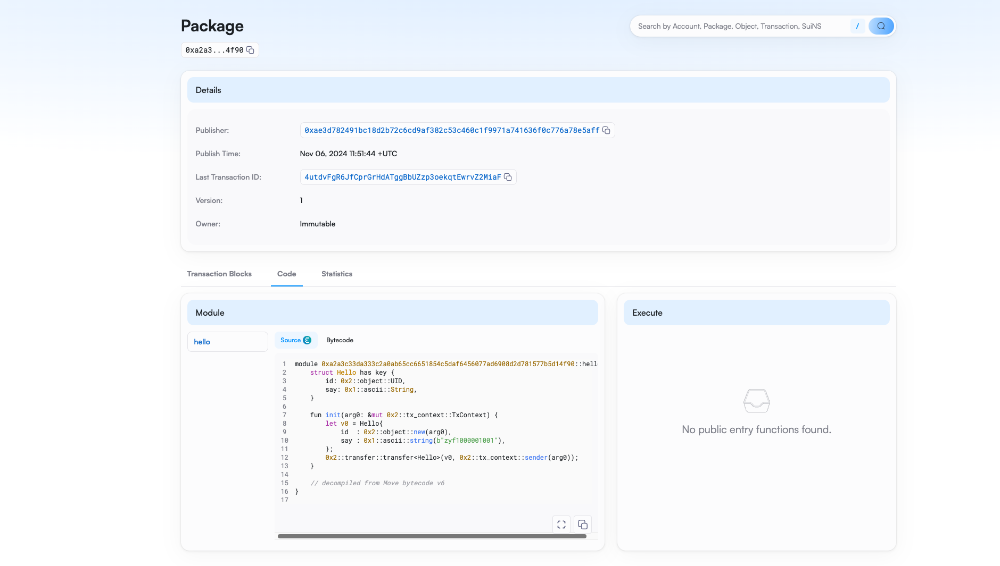

## 基本信息
- Sui钱包地址: `0x5f0a5bd4bfa12c31fdb379e7b2be921822786a129e12369a8b45f31c11ba4671`
> 首次参与需要完成第一个任务注册好钱包地址才被合并，并且后续学习奖励会打入这个地址
- github: `zyf1000001001`

## 个人简介
- 工作经验: 5年+
- 技术栈: `java` 
> 重要提示 请认真写自己的简介
- 多年 java 开发经验，前段时间在学习 solidity，公司刚好也有web3的方向，了解到 move，想学习下 move继续了解区块链知识，然后投入 dapp开发
- 联系方式: tel: `18137102303` 

## 任务

##   01 hello move  
- [x] Sui cli version: sui 1.37.1-homebrew
- [x] Sui钱包截图: )
- [x] package id: 0xa2a3c33da333c2a0ab65cc6651854c5daf6456077ad6908d2d781577b5d14f90
- [x] package id 在 scan上的查看截图:)

##   02 move coin
- [] My Coin package id : 
- [] Faucet package id : 
- [] 转账 `My Coin` hash:
- [] `Faucet Coin` address1 mint hash:
- [] `Faucet Coin` address2 mint hash:

##   03 move NFT
- [] nft package id :
- [] nft object id : 
- [] 转账 nft  hash:
- [] scan上的NFT截图:

##   04 Move Game
- [] game package id :
- [] deposit Coin hash:
- [] withdraw `Coin` hash:
- [] play game hash:

##   05 Move Swap
- [] swap package id :
- [] call swap CoinA-> CoinB  hash :
- [] call swap CoinB-> CoinA  hash :

##   06 Dapp-kit SDK PTB
- [] save hash :

##   07 Move CTF Check In
- [] CLI call 截图 : 
- [] flag hash :

##   08 Move CTF Lets Move
- [] proof : 
- [] flag hash :
