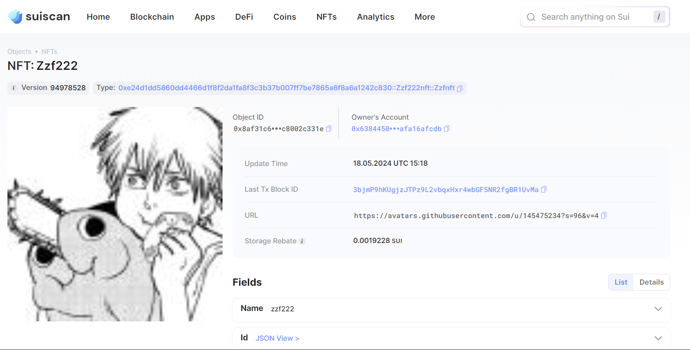

## 基本信息

- Sui钱包地址: 0xdb487655b3fd2c508ffbb8579c3df2151fb8c0abdd812a91738ad3b7a2ef6f2c
  
  > 首次参与需要完成第一个任务注册好钱包地址才被合并，并且后续学习奖励会打入这个地址

- github: zzf222

## 个人简介

- 工作经验: 0年
- 技术栈: c、java
- 有ctf经验，对Move特别感兴趣，想通过Move入门区块链
- 联系方式: 1573996155@qq.com

## 任务

## 01 hello move

- [x] package id: 0x088deca296ddda37cd70c8a13ed62a1989a56094232187e6f41b9dbf3b38a8ad

## 02 move coin

* [x] My Coin package id : 0xd9c9c49e9ea667689797bbde157f85113c97c375fdb0198132c4624073114256
* [x] Faucet package id : 0xd9c9c49e9ea667689797bbde157f85113c97c375fdb0198132c4624073114256
* [x] 转账 `My Coin` hash:G4wNfeX7fbEGjVddERgWbjcxZtKRtvTFtysP6DrNbzrb

## 03 move NFT

- [x] nft package id :0xe24d1dd5860dd4466d1f8f2da1fa8f3c3b37b007ff7be7865a6f8a6a1242c830
- [x] nft object id : 0x8af31c6714f7cc80b505a9e05b55d78a49124ba46d1274136ca68ac8002c331e
- [x] 转账 nft  hash:3bjmP9hKUgjzJTPz9L2vbqxHxr4wbGF5NR2fgBR1UvMa
- [x] scan上的NFT截图:

## 04 Move Game(testnet)

- [x] game package id :0xc8f1bc31bb1cb8c61c34304b29c37707a043ac37044c52620ce64b3ac88d013a
- [x] deposit Coin hash:HNem8ymD6Uc5fA4NtB1oUExytLFhVwmWgmuSoVGG5fku
- [x] withdraw `Coin` hash:9eWnQmZxfB9ZK7yEHA6mJoY1rQjQ9K29EnC3wh7yMt7s
- [x] play game hash:5vAs2Lbdqj3PJdfHYemSS2gKrXp7XrnsX9Zcqun59ekK

## 05 Move Swap

- [x] swap package id :0xc15c1483fe48ef1aed79376fc78ab5e83441482f909a76f4553dca580edebe61
- [x] call swap CoinA-> CoinB  hash :3NXBY7M3AaUFV2dnCbVb4sv6HN96BPrLDLSmyNcrbXtB
- [x] call swap CoinB-> CoinA  hash :F6nN3y1y6N359x2roSqpisTuvFkvFyhBSg3hWTEcGS6u

## 06 SDK PTB

- [] save hash :

## 07 Move CTF Check In

- [x] save hash: [9S7wBmRFpT65tcaGR9mJ8w9UFKauwwcsM6cbg55mvrTr](https://suiscan.xyz/testnet/tx/9S7wBmRFpT65tcaGR9mJ8w9UFKauwwcsM6cbg55mvrTr)
