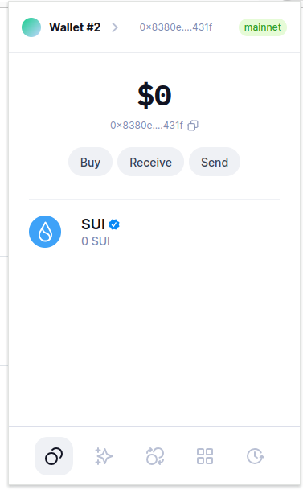
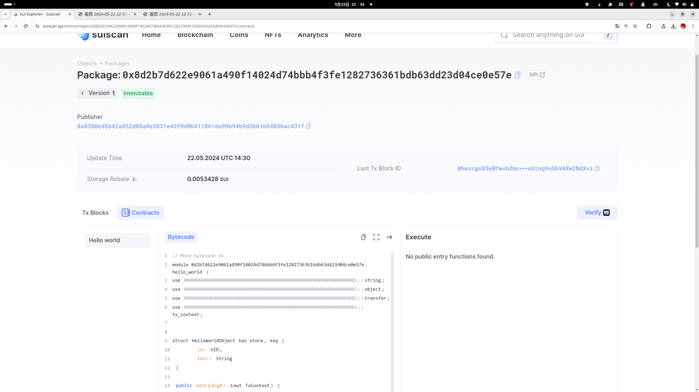
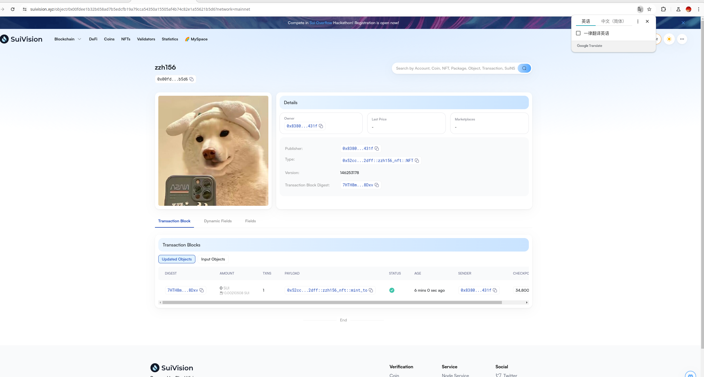

## 基本信息
- Sui钱包地址: `0x8380ed5b42a052d88a0e3031e43f0d06411861da99b94b9d3b61b54036ac431f`
> 首次参与需要完成第一个任务注册好钱包地址才被合并，并且后续学习奖励会打入这个地址
- github: `zzh156`

## 个人简介
- 工作经验: 0年
- 技术栈: `Dart` `go`
> 重要提示 请认真写自己的简介
- 大二在读，对Web3十分感兴趣，想通过MOVE入门区块链
- 联系方式: tg: `zzh156` 

## 任务

##   01 hello move  
- [] Sui cli version:sui 1.25.0-3a062ec78620
- [] Sui钱包截图: 
- [] package id: 0x8d2b7d622e9061a490f14024d74bbb4f3fe1282736361bdb63dd23d04ce0e57e
- [] package id 在 scan上的查看截图:

##   02 move coin
- [] My Coin package id :  0xe11ae5f04133b9c22941b762dd4a10486e3baa75e84ce1391c1b90c481205fff
- [] Faucet package id : 
0x2ec8b9fbacf54322e3cafebcef8d6b7129e5dcd0bafcb168b4a3fb5d50c4c580
- [] 转账 `My Coin` hash:HwQxVNqQfDmmTvW31sQYdfygHyQ8c6ZrStcbUjBeriQe
- [] `Faucet Coin` address1 mint hash:
EPcUhu3HzYqgTzM7JxgfdaSLiuTBeWM5eyj6hq6DB7tk
- [] `Faucet Coin` address2 mint hash:
Cx3XaHnZ6U12wZgMxAjNY4EhsxH7u2TTs8FdCBTGCZKj

##   03 move NFT
- [] nft package id :0x52cccd4198f4c5279971c9a4d9c282ea607c684bd368d8c94384e76468cf2dff
- [] nft object id : 0x00fdee1b32b658ad7b5edcfb19a79cca54350a15505af4b74c82e1a55621b5d6
- [] 转账 nft  hash:Cb94mwmZpuDeEgCjKriWPgQro2B2xVHDk3h2dBPujkqD
- [] scan上的NFT截图:

##   04 Move Game
- [] game package id :
- [] deposit Coin hash:
- [] withdraw `Coin` hash:
- [] play game hash:

##   05 Move Swap
- [] swap package id :
- [] call swap CoinA-> CoinB  hash :
- [] call swap CoinB-> CoinA  hash :

##   06 Dapp-kit SDK PTB
- [] save hash :
