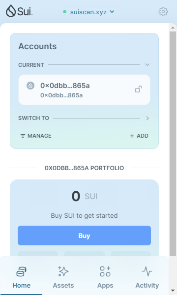
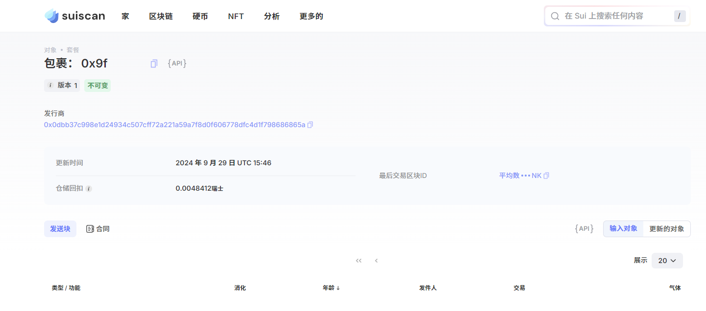
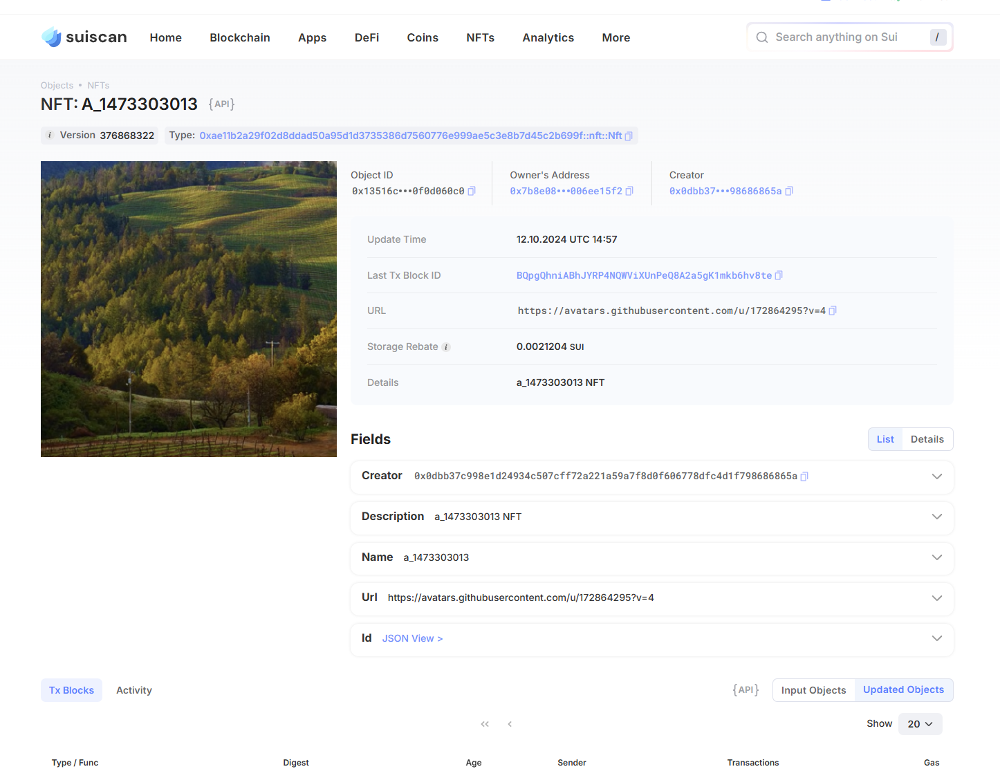

## 基本信息
- Sui钱包地址: `0x0dbb37c998e1d24934c507cff72a221a59a7f8d0f606778dfc4d1f798686865a`
> 首次参与需要完成第一个任务注册好钱包地址才被合并，并且后续学习奖励会打入这个地址
- github: `zzulihjh`

## 个人简介
- 工作经验: 0年
- 技术栈: `Rust` `python`
> 重要提示 请认真写自己的简介
- 对Move特别感兴趣，想通过Move入门区块链
- 联系方式: tg: `mu shu` 

## 任务

##   01 hello move  
- [] Sui cli version: 1.34.0
- [] Sui钱包截图: 
- [] package id: 0x9f731aefab94655d53ab08f8787c2309e278999b3af6a28062932099ef3e9e3f
- [] package id 在 scan上的查看截图:

##   02 move coin
- [] My Coin package id : 0x09382c83551cdc5ed79a46e9ee779a45ed2c5323a334be1e4b597e99a9de2f08
- [] Faucet package id : 0xb3da786e91b74fa5c6b8f434179dfe36dd84039592c81c36ba7185b1ff5c859e
- [] 转账 `My Coin` hash:92Q71D2HgFJQKicucmHQda4cE9GudXhSbKVYanUvHTyQ
- [] `Faucet Coin` address1 mint hash:5nnbbq8215gD4WBBrB45KzUnuLijFeFZjVC17YTLsA6d
- [] `Faucet Coin` address2 mint hash:62b2A6UBrgTmkR59kF3GcoU6NdhNnvQpHkPxRWgFRhhf

##   03 move NFT
- [] nft package id :0xae11b2a29f02d8ddad50a95d1d3735386d7560776e999ae5c3e8b7d45c2b699f
- [] nft object id : 0x500d051a513590e044f645b986941c1813cadf819f8dd835dd1125d78c99847b
- [] 转账 nft  hash:BQpgQhniABhJYRP4NQWViXUnPeQ8A2a5gK1mkb6hv8te
- [] scan上的NFT截图:

##   04 Move Game
- [] game package id :
- [] deposit Coin hash:
- [] withdraw `Coin` hash:
- [] play game hash:

##   05 Move Swap
- [] swap package id :
- [] call swap CoinA-> CoinB  hash :
- [] call swap CoinB-> CoinA  hash :

##   06 Dapp-kit SDK PTB
- [] save hash :

##   07 Move CTF Check In
- [] CLI call 截图 : 
- [] flag hash :

##   08 Move CTF Lets Move
- [] proof : 
- [] flag hash :
